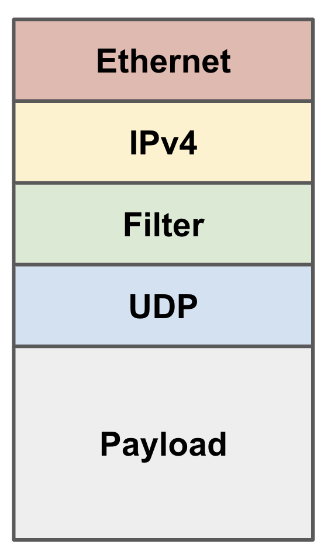

# Filtering suspicious packets

In this exercise, you will extend the functionality in [forwarding](../forwarding)
to filter and mark suspicious traffic. 

We use the same topology in this exercise as well:


## The filter header

Packets that enter the network from the hosts have an
extra header, which we call the filter header. The filter header
sits between the IP and UDP headers:



When the `protocol` filed in the IP header is 146, it means 
that the next header is the filter header.

The filter header has two fields:

1. `susp` (8 bits), which should be set to one if a packet is suspicious and zero otherwise. 
Originally, this fields is zero for all packets that enter the network. 

2. `proto` (8 bites), which determines what protocol the next header belongs to. All the packets
that enter the network will have this fields set to 17, which means the next header will be a
UDP header. You can find a sketch of the UDP header [here](https://en.wikipedia.org/wiki/User_Datagram_Protocol).

**What you need to add:** Modify the [filter.p4](./filter.p4) program in the designated
areas to define the filter and UDP headers, instantiate them, and parse them. 

## The filter table

In this exercise, we detect suspicious packetes based on their
source IP address and source (UDP) port. Suppose we have a
list of such suspicious (IP, port) pairs. We want to define a 
table in the switch data plane that will match on source IP address
and source port of the packet, and if the value matches the list, 
set the `susp` field in `filter` header to one. 

**What you need to add:** Modify the `MyIngress` control block in the [filter.p4](./filter.p4) program 
to add the `filter` table with appropriate keys and actions. Later, we will 
populate this table from the controller. Also extend the code in the
`apply` block in `MyIngress` to first check if the `filter` and `udp` headers are valid, 
and if yes, apply the `filter` table before performing IP forwarding. 

## The deparser

The deparser specifies, using `emit` statements, which headers should 
go back in the packet and in what order. If a header is invalid (e.g., has not 
been parsed), the corresponding `emit` statement will not 
add it to the packet.

**What you need to add:** Modify `MyDeparser` to add `filter` and `udp` headers back to
the outgoing packet.

## The controller

The list of suspicous (IP, port) pairs is stored in `susp.txt`. The controller ([mycontroller.py](./mycontroller.py))
reads the list and installs rules in the `filter` table accordingly. 

**What you need to add:** Fill in the `writeFilterRule` function in 
[mycontroller.py](./mycontroller.py) to populate the `filter` table.

## Running the exercise

1. In your shell, run:
   ```bash
   make run
   ```
   This will:
   * compile `filter.p4`,
   * start a Mininet instance with four switches (`s1`, `s2`, `s3`, `s4`)
     configured as shown in the pod topology, each connected to one host 
     (`h1`, `h2`, `h3`, `h4`), and
   * assign IPs of `10.0.1.1`, `10.0.2.2`, `10.0.3.3`, and `10.0.4.4` to the respective hosts.

2. You should now see a prompt that asks you to run the controller first.

3. Open another shell and run the controller:
   ```bash
   cd ~/tutorials/exercises/filter
   ./mycontroller.py
   ```
   This will install the `filter.p4` program on the switches and push the
   forwarding and filter rules. 
   
4. In the first shell, write `done` and press enter. 
5. The script in the first shell will then continue running and send packets between hosts. Some of these packets will be suspicious and some will not.
6. After the packets are sent, the script will check whether they were correctly marked as suspicious or not. Any mismatches will be reported on the screen.

Note that while you will not see the Mininet prompt in this exercise, the `run_exercise.py` script is using Mininet behind the scenes to create the network and send traffic.

### Debugging

There are several log files in the `logs` folder that can help you debug your code. Specifically `si.log` files contain logs of the steps taken at switch `si` when processing each packet. Note that there are other traffic in the network besides the ones that we generate for the purpose of this exercise. So, you may need to look/search carefully to find logs for the packets you are intersted in. The `h*_out.txt` files contain a list of packets received at each endpoint and can be useful for checking whether you are marking packets correctly or not. 

## Potential Issues

If you see the following error message when running `mycontroller.py`, then
the gRPC server is not running on one or more switches.

```
p4@p4:~/tutorials/exercises/p4runtime$ ./mycontroller.py
...
grpc._channel._Rendezvous: <_Rendezvous of RPC that terminated with (StatusCode.UNAVAILABLE, Connect Failed)>
```

You can check to see which of gRPC ports are listening on the machine by running:
```bash
sudo netstat -lpnt
```

The easiest solution is to enter `Ctrl-D` or `exit` in the `mininet>` prompt,
and re-run `make run`.

## Cleaning up Mininet

If the Mininet shell crashes, it may leave a Mininet instance
running in the background. Use the following command to clean up:
```bash
make clean
```

## Relevant Documentation

The documentation for P4_16 and P4Runtime is available [here](https://p4.org/specs/)

All excercises in this repository use the v1model architecture, the documentation for which is available at:
1. The BMv2 Simple Switch target document accessible [here](https://github.com/p4lang/behavioral-model/blob/master/docs/simple_switch.md) talks mainly about the v1model architecture.
2. The include file `v1model.p4` has extensive comments and can be accessed [here](https://github.com/p4lang/p4c/blob/master/p4include/v1model.p4).
